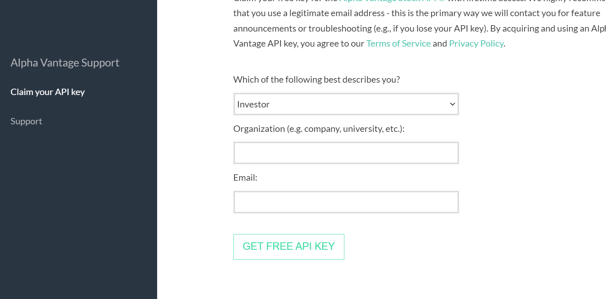

* hacker rank and letcode for practising purposes.

* python is dynamic type language

* we cannot give datatype

* toggle add break point (using f9 ) and f10 is exicure line by line in the program

* 3 types of casings  in variables

* python does not have constant

* python use upper case variable names

    * pascal (MyName)
    
    * camel (java) myName
    
    * snake (python)my__name
    
## conditional statements in python 


```python

Number = 10
name = "python"
other_name = "py"
is_good = True

```
[link refer](https://www.programiz.com/python-programming/operators)

num1 = 10

num2 = 5

print(num1 + num2)

print(num1 - num2)

### python

num1 + num2 
num1 - num2
num1 / num2
num1 % num2
num1 * num2


exit()


## operator precedence

#### BODMAS 

[refer link](https://pythongeeks.org/python-operator-precedence/)

### while

```yaml
while "<expression>":
    body ....
    ........
    ...

example

index = 1
while index <=10:
    print(index)
    index += 1
```

* one while loop consists inside of the while loop one or more while loops and one or more if loops but its not a good idea

* continue means remaining conditions are skipped and start from starting on words

### for loop

```yaml
for item in <collection/sequence>:
    body ...


example

sum = 0
for number in range(1,1000):
    if number % 3 == 0 or number % 5 == 0:
        sum += number
    print(sum)
```

* in while loop we add extra condition (finaace condition)
 but in the for loop it automatically takes the loop in that range


# function

* function is a reusable block of code

function <nameof function>(arg1,arg2........):
     .....
     ........
     return <value>

example:

 def add(x,y):

### docstring in python

* this python module(file,py)   will  have the reusable  function


```python
"""
def is_even(number: int):
    args:
      number: number passed
    returns:
      True if even, False otherwise
    usage:
      is_even(52)
      return True
"""
# gobal result some times we use

if number <= 0:
    return False
    result = number%2 == 0
    return result
# call the function
number = 19
if is_even(number):
    print("even number")
print(result)
```

* the functions we cannot give names like num1=2 , numb2 = 3 this type of function is called possisionalarguments 

* while the concept of "positional arguments" relates to how arguments are passed to functions based on their position, "anonymous" or "lambda" functions refer to functions without names.

## interesting function

* installing pip install heartrate

* installing pip install snoop

#### above functions are used to debugging or tracing

### sequence datatypes

    * sequence :

        string :


        list : this method returns a list of numbers

```python
value = []
type(value)

ex: 

signals = ["red", "green", "blue"]
numbers = ["1", "2", "3", "4", "5"]
dummy_list = ["red", "1", "true"]


```

# pass
 it returns a empty function

### slicing

* slicing basically workout start:end:

ex:

numbers[::2]
numbers[1::2] # output 2,4,6,8.....

## append : insert value

## tuple: 

tuples also work like lists 

touple is passed when executing the program

names = ("a", "b", "c)
names[0]
names[1::-1] ## print in a reverse order

tuples cannot be changed once initialized

if you know the size is fixed for variables, you can use tuple , in acse variable you want to change the size add or decreasing we go for the list .


### filter function

sum(list(filter(is_even,get_fibbonaci_sequence(max))))
result = list(filter(is_prime , range(1,10000)))
print(result)

## dictionary

it is basically key value pairs

```distionari of ipl teams

<variable_name> = {
    'key1': 'value1',
    .............
    ........
}


ipl_teams = {
    'hyd': 'sun rises',
    'mumbai': 'mumbai indians'
}

```
# access values 

```
ipl_teams['key1'] = 'value1'

ipl_teams['chenai'] = 'value2'

print(ipl_teams)
```

## loop trough dictionary

for city , name in ipl_teams.items():
    print (city, end=" ==>")
    print(name)

city ==> team name
------------------------
Hyderabad ==> team name
mumbai ==> team name

# loop through

for city in ipl_teams.keys():
    print(team_name)

for city in ipl_teams.values():
    print(team_name)

# copy dictionary

my_ipl_teams['delhi'] = 'delhi-capitals'
  


 
my_ipl_teams = ipl_teams.copy()

## set

* this is unique item 

courses = {'aws','azure','gcp','python'}

## calculator with 

* create  folder in github (readme.md)

* python -m venv .venv # command line

* source .venv/bin/activatea # for linux

* .venv/Scripts/activate # for windows

* selete python interpreter from .venv 

```
windows 

ctrl +shift + p   ==> command palette

mac 

<!-- cmd + shift + p ==>command palette -->

### usage:

* python calc.py <action> <num1> <number2>

* python calc.py div 10 5

## [link](https://www.perplexity.ai/search/how-to-add-VY3cte4WS5m1Ol012l6EJg)


* pipi install pylint 

>>>>>>>>pylint calc.py


## package 

* package is a directory with modules . package has file callled as '__init.py'

* inside the file we have created a modules

* 2 files will be created one is present in the 1.2.6 another file stores in the 1.3.6 the how can we use this  two files  by using python environments .

* vertual environments help in setting up local project and its dependencies .

* install dependencies after activating virtual environment .

* python -m venv .venv

* pip freeze > requirements.txt

* we do multible projects in one system we want vertual environments , incase we don't have many projects we use one system for one project , we don't want vertual environments .

* pip install pytest 

* the contexts of requirements.txt are as shown below

colorama==0.4.6


## assert

* the assert will not complain about what ever will have do inside the function .

ex: def test_lumpsum():
        assert(lumpsum('1000' , '0', '15')==1000)

        for 0 intrest we get principal amount from any number of years


* pip install ansible

### do the following operations

     convert into uppercase , lower case , title 
     
     print message which is 'Hello <name>, Welcome'

     compare strings

     format
     
     f-strings


## i want to store the all result in lumson or sip caluclated values in the file (for that purpose we store in the data bases will be used)

* working with files on python

```python
"""this module is store the result in test file
"""
```

## file exits or not os operationmis used

if os.path.exists(path):
    filt_exits = true
## add headers for csv files

## generators in python

* rather than sending a list as random 

* understanding generators in python 

* write a program to find odd numbers b/w start and stop

[refer here](https://github.com/pythonbykhaja/April24/commit/8c470202de1aebfe041e0300c4d8da4750352b46)

```python
def odd_numbers(start, end):
    results = []
    for number in range (start, end+1):
        if number%2 != 0:
            results.append(number)
    return results

odd_numbers(10,23)


def odd_numbers_gererator(start, end)
    for number in range(start, end+1):
        if number % 2 != 0:
            yeild = number

for number in odd_numbers_gererator(10,23):
    print(number)


```
## fluent python book is


## declorate

* inside decorator function we have wrapper . 

* wrapper is called as child function of decorater

```python
def write_to_database():
    print(write_to_database)
def debugmy(func):
    def wrapper():
        print("something is going to start ")
        func()
        now = datetime.now()
        current_time = now.strftime("%H-%M-%S")
        

        
```

## function also called by variable 

```python


```

## nested function 


parent function::  in side the parent function have  no.of chaild functions

chaild function::

```python

def parent()

```

## 25/04/2024

### json

* python is a part of include json 

        * python

        * import json

        * type(y)

        * y['name']

        * y.items()

        * y.keys()

* any json file you want to write all is the dictionary

        * import json

        * json.dumps(records)

        * print(json.dumps(records))

        * print(json.dumps(records, index=2))

```json
"""this module is utilities to write the data in json
"""
import json
import os
RESULT_FILE_PATH = "results.json"

def write_results(principal,
                  future_value):

"""Write the resultsin csv file
"""

```

## content

* content is having of records of dictionary


## task (1) create loan calculator for emi


## how can i query(get/fetch) the data from previously stored data

* disks -- > file -->


* file size is less sized we fetch the data from the file is easy . but data file size is large that is complicated to get the data.

* data is 2 types (1) structered data
                   
                  (2) unstructered data

data have 2 variables (1) relational database

                       (2) no sql (mangodb , casandra , dynamo db)

                         * azure casmos
                         * aws dynamodb
                         * gcp 
## download sqlite

* ORM: object relational mapping 

* OOP: object oriented programming

* calling external functionality to use the application by using APIS

* SDK : software development kit

## proble 

* create one environment , create one folder ,


##  we have 1000 files, i want sizes of each value we are using mapping

##  we have 1000 files, i want to data from file we use filters


### object oriented programm using python

    * class: 

         this is designed template of an object  , we use class to create objects .

    * object: 
        contents: numbers(members)
        charectoristics: methods

        * objects have 2 types of relationships
         * create one environment

                python -m venv .venv

         * pip install pytest

                create __init__.py file
                pytest

         * pip install coverage

                coverage run -m  pytest 
                coverage report

        inheritence (is-a):
        composition (has-a):

    * attributes:

    * methods:

### create student and course implementations according to any institute and design  


### python dunder (double underscore method)

* create magicmethod.py

* _(single underscore) reprasents the private information we cannot access directly

### str

* string return value

## dump

* ge = greater than equals
  le = less than equals
  gt = greater than
  lt = less than

### exception handling

* try-exception:
 error happens check exception

 * pytest exception

 [refer here](https://stackoverflow.com/questions/23337471/how-do-i-properly-assert-that-an-exception-gets-raised-in-pytest)

we show the pytest we right below commands 

* we can't handle the all exceptions , but some common exceptions we can handle that .

 with pytest.raises(negativeBalanceException)

 with pytest.raises(HighBalanceException)

### exercise

* take a date as input in the formate of dd/mm/yyyy
* convert that into python date class
* try to print this date in atleast 2 different locale
* print the date in iso standard


strptime():
 The function accepts the string and converts it into a datetime object.

string_date: 
The string contains the date and timezone you want to convert to the datetime object.

format: 
It is the pattern of datetime, It is made of individual code which represents the part of the date such year, month, day, hour, second, minute, including timezone data.

## locale : localaization

### rest API 
# tese are old process
* ROC:
IPC:     
REMORT PROCESS:

## resent & populer way

SOAP(SIMPLE OBJECT ACCESS PROTOCOL): TCP AND HTTP 

SOAP CLIENT: 


### GRAPH API

send info 
1xx: information
2xx: success
3xx: redirection
4xx: client error
5xx: server error

_____

cd ./basics
./venv/scripts

### stack market data

* goto alpha vantage and create some free key
```
* stock_market
    * pytest.ini
    * requirements.txt
    * stock_market
        * __init__.py
        * library
            * __init__.py
            * stocks.py
            * exceptions
            * external
                * __init__.py
                * alphaventage.py
    * tests
        * __init__.py
        * libraries
            * __init__.py
            * external
                * __init__.py
                * test_alphaventage.py
    * .vscode
        * settings.json
```
in the place of endpoint url u can change the modifications




### APIS

##### FAST API

* FAST API IS python frame work 

* a modern 


## rest api

* this is called as reprasentational state transfer and an architectural style for building api's 

* rest api is layered architecture


    * graphQL : rest api quary langrage 

    * GRPC: Google Remote Procedure Cal

     


pip install fastapi
uvicon 
# we run the web application we need some of midlle ware .. that purpose we fix 

# in get place we use this options put , post, error handler, route ...

```
from fastapi import FastAPI

app = FastAPI
@app.get("/")   

def read_home():
    """
    """
    return("hello world": "Fast API") # default port is 8000
    
```


## python code calls by using the cli 

url = "http://ipv4:<port><query-string>

* we want to change that query string to something json file 
* query data is passing optional data not for main data 

* ex: below shows the query data for options

https://www.amazon.in/Tanna-Enterprise-Rotatable-Protective-Accessories/dp/B0BY2FX9N8/ref=sr_1_9?dib=eyJ2IjoiMSJ9.1Cp4W31vq3h-ECRLFyRkPF_asRENvH3G0_9u4SOCKH0Os1Rh_Kq4uM0wRPvfwsHdh9-gChOh1VWwzYGOFJ3OOiDUFpcw4VhqLThMcS1s39fQQBoZ_ArHlQGmg2GdXFAy6gryB8g9w3UV0NLgk5T2Qbw63TXMvq7GQPDunsxb19RTXBDcN90wTC1Bdh6tao-hGHRqJa18lh8xM3aEOxBZFmDPSZKWSxQB8whn-u_gyZo.vFKf1mEPUqSmMGXnsuPNIG8dbeoRdZ3KGZkA0O1o7J0&dib_tag=se&keywords=mobile+data&qid=1714530889&sr=8-9


### how to store student information into the database


* TestClient import it .

* 


* difference between basemodel and method 


### ORM AND ODM FRAMEWORK

ORM: object relational manner

* python 

ODM: object document manner

* python ODM framework

[refer](https://realpython.com/python-sqlite-sqlalchemy/)

above sqllite sqlalchemy

* pip install sqlalchemy

* pip freeze > requirements.py

* create persistent folder 
        * __init__.py
### create aws accounts

* iam user create 

* write an api for inverstment calculator 

* write an api for interview questions  "get and post"

* today i will be sharing a github repo with get , post , put and delete methods write unit tests for all of this  with a coverage of 95% expected . 

* write python code to copy all the files including folder from one location to another  'python copy.py "/tools/" "/toolsbackup"

wq explore 'os' and 'shutil' libraries


resume tsl portal


 


